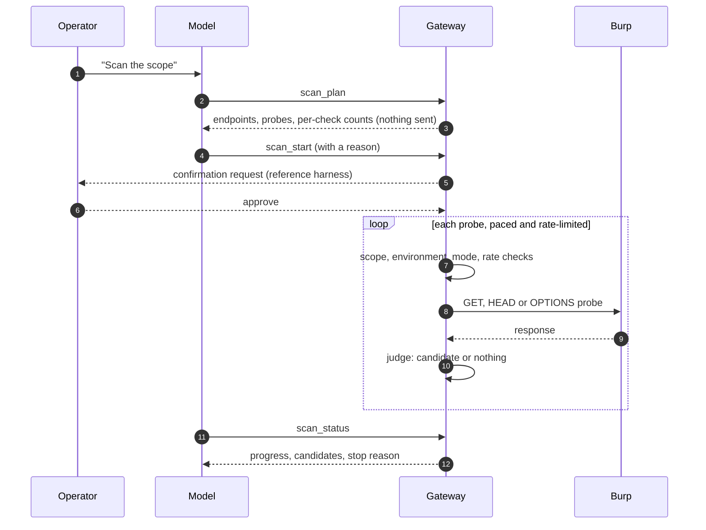

<div align="center">

# burp-agent-mcp

**An MCP gateway that lets a language model work with Burp Suite, on authorized test and staging environments only.**


[](https://github.com/WaiperOK/burp-agent-mcp/actions/workflows/tests.yml)


</div>

> **For authorized security testing only.** Point it only at systems you are explicitly permitted to test.

---

## Why

Language models are useful for triage, hypothesis checks and repetitive testing, but they should never reach a target directly.
This gateway sits between the model and Burp. The model sees a small set of tools. The gateway enforces **scope, environment, mode and limits in code**, not in the prompt, and writes every action to a tamper-evident audit log.

## Architecture

```mermaid
flowchart LR
    LLM["LLM agent<br/>any MCP client or the reference harness"] -->|MCP tools| GW

    subgraph GW["burp-agent-mcp gateway"]
        direction TB
        POL["Policy gate<br/>scope · environment · mode · limits"]
        RED["Redaction<br/>secrets and personal data by key"]
        AUD["Audit log<br/>hash chain"]
        SCN["Scanner jobs<br/>background, budgeted"]
        BRW["Browser guard<br/>URL and host checks"]
    end

    GW -->|SSE, one persistent session| BMCP["Burp MCP Server"]
    BMCP --> BURP["Burp Suite<br/>proxy · history · repeater · scanner"]
    GW -->|Playwright| CHR["Chromium"]
    CHR -->|through the proxy| BURP
    BURP -->|HTTP| TGT["Test or stage target"]

    EXT["AgentFindings extension<br/>passive checks · JS export"] -.->|writes| FIND[("findings<br/>JS bodies")]
    FIND -.->|read by| GW
```



## Safety model

Every active action passes through the same layers. A layer that says no stops the action, and the refusal is logged.

| Layer | What it does | Enforced by |
|---|---|---|
| **Environment gate** | Active actions run only when `environment` is `test`, `stage`, `staging` or `lab` | gateway code |
| **Scope** | Hosts (`authorized_hosts`) and URL prefixes (`scope_urls`); `..` and encoded dots are refused | gateway code |
| **Mode** | `read_only` turns off every action that sends traffic | gateway code |
| **Limits** | Requests per minute, total per session, scanner budget, intruder ceilings, time limits | gateway code |
| **Refusals** | No authentication brute force, no password or secret fields, no out-of-scope navigation; stop on 429 and 503 | gateway code |
| **Integrity** | The policy hash is recorded at start; an edit to `policy.json` blocks active actions until restart | gateway code |
| **Confirmation** | Active tools ask the operator before they run | reference harness |
| **Audit** | Hash-chained JSONL log, refusals included; `audit.py verify` checks the chain | gateway code |
| **Redaction** | Cookies, tokens, emails and personal-data keys are masked before the model sees the data | gateway code |

## Tools

34 tools in three groups. Read-only tools never send traffic to a target.

| Group | Tools |
|---|---|
| **Read-only** | `scope_status` · `search_proxy_history` · `list_endpoints` · `get_history_item` · `search_bundles` · `openapi_coverage` · `diff_responses` · `scanner_issues` · `read_passive_findings` · `read_universal_report` · `scan_plan` · `scan_status` · `plugin_list` |
| **Browser, read-only** | `browser_state` · `browser_text` · `browser_links` · `browser_forms` · `browser_wait` · `browser_screenshot` |
| **No traffic to target** | `repeater_tab` creates a tab in Burp Repeater for a person to send by hand · `scan_stop` · `plugin_write` writes a Burp extension's source · `plugin_compile` builds its jar |
| **Active** (`mode=active`, `environment` set) | `request_url` · `send_request` · `replay_variant` · `intruder_run` · `scan_start` · `browser_open` · `browser_click` · `browser_fill` · `browser_press` · `browser_back` · `browser_reload` |

`request_url` takes `dry_run=true` to preview the exact request without sending it or spending budget.

`browser_fill` refuses password fields and fields that look like secrets. Secrets are never typed by the agent; logging in is done by a person with the `login` command.

## Quick start

```bash
git clone https://github.com/WaiperOK/burp-agent-mcp.git
cd burp-agent-mcp
python3 -m venv .venv
./.venv/bin/pip install -r requirements.txt
./.venv/bin/python -m playwright install chromium
cp policy.example.json policy.json
```

Register the gateway in your MCP client as a stdio server:

```json
{
  "mcpServers": {
    "burp-agent": {
      "command": "/path/to/burp-agent-mcp/.venv/bin/python",
      "args": ["/path/to/burp-agent-mcp/server.py"],
      "env": { "BURP_AGENT_POLICY": "/path/to/burp-agent-mcp/policy.json" }
    }
  }
}
```

Then load the Burp extension (see below) and set the scope.

## Set the scope

The scope belongs to the owner. Set it from a terminal with `scope_cli.py`, not through the model:

```bash
./.venv/bin/python scope_cli.py show
./.venv/bin/python scope_cli.py env test
./.venv/bin/python scope_cli.py add-host app.example.test
./.venv/bin/python scope_cli.py add-url https://app.example.test/
./.venv/bin/python scope_cli.py add-spec ~/specs/openapi.json
./.venv/bin/python scope_cli.py set max_active_requests_total 2000
```

Each write is validated by the policy loader first; an invalid policy is never saved. Restart the session afterwards, because the gateway reads the policy at startup.

A minimal policy (see `policy.example.json` for every field):

```json
{
  "engagement_id": "ENG-2026-01",
  "mode": "active",
  "environment": "test",
  "authorized_hosts": ["app.example.test"],
  "scope_urls": ["https://app.example.test/"],
  "allowed_methods": ["GET", "HEAD", "OPTIONS"],
  "max_requests_per_minute": 30,
  "max_active_requests_total": 2000,
  "scan_max_requests": 150
}
```

## Workflow: scanning a scope



The scanner runs the checks below. Each one produces a *candidate* for manual review, never a confirmed finding:

| Check | Idea | Candidate |
|---|---|---|
| `auth` | Repeat the request without `Cookie` and `Authorization` | authorization is not enforced |
| `ids` | Try neighbouring numeric ids | objects can be enumerated (IDOR lead) |
| `malformed` | Put a quote where a numeric id is | unhandled server error |
| `reflect` | Put a unique marker in a query parameter | reflected input |
| `params` | A quote in each query parameter, then an always-true condition (`' OR 1=1--`) | SQL error text (`sql_error_candidate`), or a response much longer than the baseline (`sql_boolean_candidate`) |
| `post` | A quote and a marker in each string field of a JSON POST body | SQL error text, 5xx, or the marker echoed back (`reflected_input_candidate`) |

The `post` check sends POST requests, so it needs `POST` in the policy's `allowed_methods` and the check named in the scan. Login, registration, password and token endpoints are never probed, and a body with a password, token or other credential-like field is never sent again, because the recorded secret would go back to the target. Only JSON bodies are probed. Credential-like parameter names (`token`, `password`, `key` and similar) are not varied.

To scan as a signed-in user, run `python browser_guard.py login <url>` once and sign in by hand in the window that opens. The gateway never types passwords. Requests recorded from that session carry the login, and the authorization probes use them.

Each candidate from a GET request is repeated once when budget allows and marked `reproduced: true` or `false`. A repeat never takes budget from probes that have not been sent yet. Candidates from POST requests are not repeated, because a second POST would change data on the target again. `scan_status` also returns `groups`: the same problem on one path as one row, with a count.

Requests are limited by `scan_max_requests` and paced by `scan_min_delay_ms`. The scanner stops on 429 or 503, after a series of errors, or when asked. Findings go to `scan_findings.jsonl` with owner-only permissions.

## Burp extension

`burp-extension/AgentFindings.jar` runs passive checks on responses that already pass through Burp and exports JavaScript bodies for search. It sends nothing to targets.

Load it in Burp: **Extensions → Installed → Add → Java**, then select the jar.

To rebuild it against your own Burp:

```bash
javac -cp "/path/to/burpsuite.jar" -d build burp-extension/AgentFindings.java
(cd build && jar cf ../AgentFindings.jar AgentFindings*.class)
```

The extension writes only for hosts listed in `~/burp_agent_findings/scope.txt`, one per line.

### Plugins written by the model

`plugin_write` saves a Burp extension's Java source in a `plugins` folder next to the findings file. `plugin_compile` builds it into `<name>.jar`. The gateway never loads a plugin: you add the jar yourself in Burp (**Extensions → Installed → Add → Java**).

- Compiling runs `javac` and `jar` with fixed arguments and never runs the plugin's code.
- Refused: starting processes, raw sockets, dynamic class loading, `System.exit`. Reported for review: file and environment access.
- Each jar records the hash of the source it was built from. Editing the source makes the jar stale.
- The Burp jar is found through `BURP_JAR`, by default the macOS path of `burpsuite.jar`.

These checks are a review aid, not a sandbox. Read the source before you load the jar.

## Testing

```bash
./run_tests.sh
```

243 tests across thirteen suites. `test_tool_contract.py` starts the gateway over stdio, as the harness does, and checks that the tools the model receives match this README and the confirmation list. They use a fake Burp upstream and local servers, so no external network is needed. Browser tests run a real Chromium. The upstream suite starts a real local MCP SSE server and checks reconnection after a restart.

## Project layout

| Path | Role |
|---|---|
| `server.py` | MCP tools, policy checks, audit calls |
| `policy.py` | policy loading, scope and environment rules, rate limiter |
| `scanner.py` | scanner probes and candidate rules |
| `intruder.py` | sequential intruder runner with ceilings |
| `httpmsg.py` | HTTP request building and parsing, Burp history parsing |
| `history_index.py` | incremental index of Proxy history, so searches by id do not rescan it |
| `upstream.py` | persistent SSE connection to the Burp MCP Server |
| `browser_guard.py` | Chromium through the proxy, with scope guards |
| `redact.py` | secret and personal-data redaction |
| `audit.py` | hash-chained audit log and verifier |
| `scope_cli.py` | owner tool for scope and environment |
| `deepseek_agent.py` | reference harness with operator confirmation |
| `burp-extension/` | Burp extension source and jar |
| `tests/` | test suites |

## Limitations

- Scanner and intruder results are candidates for manual review, not confirmed vulnerabilities.
- The gateway cannot stop a model that can edit `policy.json` and then restart the gateway. For that, the policy file needs an owner who is a separate OS user.
- Responses from targets reach the model, even after redaction. Do not use the gateway with real personal data without an agreement.
- Port and scheme of history records are assumed to be HTTPS on 443 unless the Host header says otherwise. Anything outside the scope is skipped, not guessed.
- Aggregates over Burp history are cached for 15 seconds. Use `fresh=true` to recompute.
- The Proxy history index is reused for 5 seconds, so a search or endpoint summary can miss traffic captured in the last 5 seconds. `search_proxy_history` with `fresh=true` asks Burp again. The index covers the first `max_history_records` records (default 500). It is saved as `history_index.json` next to the audit log, readable only by you, and it is checked against Burp after a restart.

## License

MIT. See [LICENSE](LICENSE).
